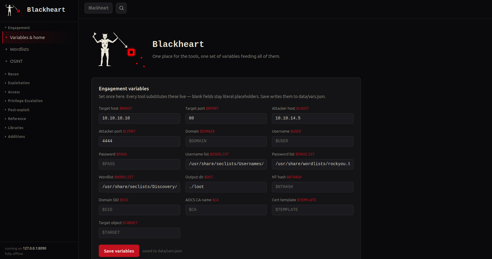

# Blackheart

  

## What it is

Blackheart is an offline pentest command kit: a local Flask app that binds to
`127.0.0.1:8090` and makes no external calls at runtime. It collects
cheat-sheets, command templates, and small utilities into one tabbed interface,
with a shared set of engagement variables that substitute live into every
command.

==Please note==
Blackheart is still in development. Any suggestions and ideas for additions are greatly appreciated.
=============== 

It contains ~40 tabs grouped by engagement phase:

- **Engagement** — variables/home, wordlists, OSINT
- **Recon** — Nmap builder, CheckMap (per-service playbooks from parsed scans), VersionCheck, ExploitCheck
- **Exploitation** — SQLi, XSS, XML, SSTI, CMS, API, Active Directory, Wireless, File Upload
- **Access** — reverse shells, listeners
- **Privilege Escalation** — Linux, Mac, Windows, GTFOBins, LOLBAS, automation
- **Post-exploit** — pivoting, persistence, pillaging, file transfer
- **Reference** — offline HackTricks, Day0 notes, cracking, decode, JWT, command obfuscator
- **Libraries** — command / tool / script libraries (your own, saved to JSON)
- **Additions** — CVSS calculator, Report Builder, and an overlay to pin your own notes onto any tab

All state is plain JSON under `data/` (`vars.json`, `library.json`, etc.).
Back up or move machines by copying that folder. The Additions tab also has
explicit Export/Import JSON buttons.

## Install

   git clone https://github.com/ruder00t/blackheart.git
   cd blackheart
   ./install.sh      # Linux/macOS
   ./run.sh          # then open http://127.0.0.1:8090

## What `install.sh` installs

It creates a Python virtualenv (`.venv`) and installs:

**Python (pip, into `.venv`):**
- Flask `>=3.0`
- PyYAML `>=6.0`
- markdown `>=3.4`
- Pygments `>=2.15`
- weasyprint `>=60`

**System packages (apt — Debian/Kali/Parrot):**
- pandoc
- libpango-1.0-0
- libpangocairo-1.0-0
- libgdk-pixbuf-2.0-0
- libffi-dev
- libcairo2
- fonts-crosextra-carlito
- tmux

**System packages (brew — macOS):**
- pandoc, pango, gdk-pixbuf, libffi, cairo, tmux, ttyd

`ttyd` is **not** in every apt repo (some Kali/Ubuntu setups don't carry it), so
`install.sh` handles it separately: it tries the package manager, and if that
fails it downloads the prebuilt static binary from ttyd's GitHub releases into
`./bin/ttyd`. The backend uses `ttyd` from `PATH` or that local `./bin/ttyd`.
If neither the package nor the download works, the terminal shows a clear
"missing dependency" message instead of failing — everything else still runs.

pandoc + the pango/cairo/gdk-pixbuf/ffi libs are for the Report Builder tab
(pandoc: Markdown → HTML; WeasyPrint runtime: HTML → PDF). `tmux` and `ttyd`
are for the integrated terminal (below). Everything else runs without them.

## Integrated terminal

The top bar has a **Terminal** toggle and four pane tiles. The toggle opens a
2×2 `tmux` grid (session `blackheart`, panes `0.0`–`0.3` = TL/TR/BL/BR) rendered
in the browser by `ttyd`; `/terminal` opens the same grid as a pop-out.

Every command block now has a **send** button beside **copy** (copy is
unchanged). `send` types the command into the active pane and *stages* it (no
Enter) so you can review it first; **shift-click** runs it (appends Enter). The
caret (▾) opens a 2×2 picker to send to a specific pane instead of the active
one. The four tiles are both the status display and the active-target selector:
click a tile to make it the send target; **blue** = empty/cleared, **green** =
has output. Clearing a pane (`Ctrl+L`) returns its tile to blue.

**Security:** the terminal endpoints shell out to `tmux send-keys` — arbitrary
command execution wired to the web app. They are **localhost-only** and refuse
any non-loopback request (403). `ttyd` is likewise bound to `127.0.0.1`. Do not
expose Blackheart or ttyd's port on a routable interface.

Run with `./run.sh` (Linux/macOS), then open
`http://127.0.0.1:8090`.

`tmux attach` connects your kali terminal to the blackheart terminals.

## Usage — variables

Set the engagement variables once on the home page; every command across every
tab substitutes them live (`$RHOST`, `$LHOST`, …). Values persist in
`data/vars.json`.

| Variable   | Meaning        | Default |
|------------|----------------|---------|
| `RHOST`    | Target host    | `10.10.10.10` |
| `RPORT`    | Target port    | `80` |
| `LHOST`    | Attacker host  | `10.10.14.5` |
| `LPORT`    | Attacker port  | `4444` |
| `DOMAIN`   | Domain         | — |
| `USER`     | Username       | — |
| `PASS`     | Password       | — |
| `USERLIST` | Username list  | seclists top-usernames-shortlist |
| `PASSLIST` | Password list  | rockyou.txt |
| `WORDLIST` | Wordlist       | seclists Web-Content/common.txt |
| `OUT`      | Output dir     | `./loot` |
| `NTHASH`   | NT hash (AD)   | — |
| `SID`      | Domain SID (AD)| — |
| `CA`       | ADCS CA name   | — |
| `TEMPLATE` | Cert template  | — |
| `TARGET`   | Target object  | — |

CheckMap additionally uses per-scan `$IP` / `$PORT` inside a single service
playbook; those are local to that tab and not part of the shared set above.

Thanks a ton to:
- Hacktricks (hacktricks.wiki)
- Lolbas (lolbas-project.github.io)
- GTFObins (gtfobins.github.io)
- Revshells (revshells.com)
- CyberChef (gchq.github.io/CyberChef)

## License\nMIT
