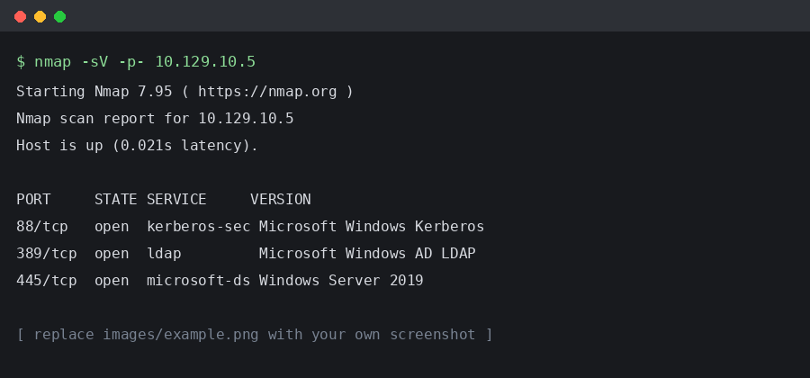

// ===========================================================================
// HOW THIS FILE WORKS
//
//   Lines starting with // are comments. They never reach the PDF.
//   Build with:  ./build.sh          (or ./build.sh --watch while writing)
//
//   Images:   {width=80%}
//             Put the file in images/ - it gets embedded into the PDF, so the
//             finished PDF stands alone and needs no folder alongside it.
//
//   Tables:   standard Markdown pipe tables (see examples below).
//
//   Findings: ::: finding  blocks in section 7. Everything else - the summary
//             table, the chart, the severity counts, the numbering and the
//             table of contents - is generated from them.
//
//   Auto-filled tokens you can use anywhere:
//     {{TOTAL_FINDINGS}}   {{RISK_FINDINGS}}      {{SEVERITY_BREAKDOWN}}
//     {{CRITICAL_COUNT}}   {{HIGH_COUNT}}         {{MEDIUM_COUNT}}
//     {{LOW_COUNT}}        {{INFO_COUNT}}
//     {{FINDINGS_TABLE}}   {{SEVERITY_CHART}}
//
//   Headings are numbered automatically. Write "# Executive Summary",
//   not "# 3 Executive Summary". Mark appendices with {.appendix}.
// ===========================================================================

# Statement of Confidentiality

// Standard confidentiality wording. Replace the party names throughout.

The contents of this document have been developed by TODO Your Name. TODO Your Name
considers the contents of this document to be proprietary and business confidential
information. This information is to be used only in the performance of its intended
use. This document may not be released to another vendor, business partner or
contractor without prior written consent from TODO Your Name. Additionally, no
portion of this document may be communicated, reproduced, copied or distributed
without the prior consent of TODO Your Name.

The contents of this document do not constitute legal advice. TODO Your Name's offer
of services that relate to compliance, litigation or other legal interests are not
intended as legal counsel and should not be taken as such.

# Engagement Contacts

## Customer Contacts

| Contact | Title | Contact Email |
|---------|-------|---------------|
| TODO Name | TODO Title | TODO email |
| TODO Name | TODO Title | TODO email |

## Assessor Contact

| Assessor Name | Title | Assessor Contact Email |
|---------------|-------|------------------------|
| TODO Your Name | Penetration Tester | todo@example.com |

# Executive Summary

// Non-technical audience. No jargon, no acronyms, no tool names.

TODO Customer Ltd. ("TODO Customer" herein) contracted TODO Your Name to perform a
Network Penetration Test of TODO Customer's externally facing network to identify
security weaknesses, determine the impact to TODO Customer, document all findings in
a clear and repeatable manner, and provide remediation recommendations.

## Approach

TODO Your Name performed testing under a "Black Box" approach from TODO START DATE to
TODO END DATE without credentials or any advance knowledge of TODO Customer's
externally facing environment with the goal of identifying unknown weaknesses.
Testing was performed from a non-evasive standpoint with the goal of uncovering as
many misconfigurations and vulnerabilities as possible. Each weakness identified was
documented and manually investigated to determine exploitation possibilities and
escalation potential.

## Scope

// One row per in-scope asset. Anything not listed here was not tested.

The scope of this assessment was TODO DESCRIBE SCOPE.

| Host/URL/IP Address | Description |
|---------------------|-------------|
| TODO 10.129.x.x | TODO External host |
| TODO 172.16.139.0/24 | TODO Customer internal network |
| TODO domain.local | TODO Customer internal AD domain |

## Assessment Overview and Recommendations

// The counts below fill themselves in from your findings - leave the tokens.

During the penetration test against TODO Customer, TODO Your Name identified
{{TOTAL_FINDINGS}} findings that threaten the confidentiality, integrity and
availability of TODO Customer's information systems. The findings were categorized by
severity level, with {{SEVERITY_BREAKDOWN}}. There were also {{INFO_COUNT}}
informational findings related to enhancing security monitoring capabilities within
the internal network.

TODO WRITE THE EXECUTIVE NARRATIVE HERE - what was found, what it means for the
business, and what the client should do about it, in plain language.

TODO Customer should create a remediation plan based on the Remediation Summary
section of this report, addressing all high findings as soon as possible according to
the needs of the business.

# Network Penetration Test Assessment Summary

TODO Your Name began all testing activities from the perspective of an
unauthenticated user on the internet. TODO Customer provided the tester with network
ranges but did not provide additional information such as operating system or
configuration information.

## Summary of Findings

During the course of testing, TODO Your Name uncovered a total of {{RISK_FINDINGS}}
findings that pose a material risk to TODO Customer's information systems. TODO Your
Name also identified {{INFO_COUNT}} informational findings that, if addressed, could
further strengthen TODO Customer's overall security posture. Informational findings
are observations for areas of improvement by the organization and do not represent
security vulnerabilities on their own.

{{SEVERITY_CHART}}

Below is a high-level overview of each finding identified during testing. These
findings are covered in depth in the Technical Findings Details section of this
report.

{{FINDINGS_TABLE}}

# Internal Network Compromise Walkthrough

During the course of the assessment TODO Your Name was able to gain a foothold via
the external network, move laterally, and compromise the internal network, leading to
full administrative control over the TODO DOMAIN NAME Active Directory domain. The
steps below demonstrate the path taken from initial access to compromise and do not
include all vulnerabilities and misconfigurations discovered during testing.

## Detailed Walkthrough

// The examiner reads this closest. Every step needs the command, the output and
// a screenshot where it proves something. Someone else must be able to repeat it.

TODO Your Name performed the following to fully compromise the TODO DOMAIN NAME domain:

1. TODO high level step one
2. TODO high level step two
3. TODO high level step three

Detailed reproduction steps for this attack chain are as follows.

**Step 1 - TODO step title**

TODO explain what was done and why.

```console
$ TODO command
TODO output
```

{width=85%}

# Remediation Summary

As a result of this assessment there are several opportunities for TODO Customer to
strengthen its network security. Remediation efforts are prioritized below starting
with those that will likely take the least amount of time and effort to complete.

## Short Term

// Quick wins - configuration changes, password resets, disabling protocols.

- TODO Finding 1 - TODO remediation action
- TODO Finding 2 - TODO remediation action

## Medium Term

- TODO remediation action requiring planning or testing

## Long Term

- Perform ongoing internal network vulnerability assessments and domain password audits
- Perform periodic Active Directory security assessments
- Educate systems and network administrators on security hardening best practices
- Enhance network segmentation to limit the effects of an internal compromise

# Technical Findings Details

// One ::: finding block per issue. Severity is derived from the CVSS score,
// so you only need to set cvss: - or set severity: directly for Info items.
// Findings are numbered in the order they appear here.
//
// Available header keys: title, cvss, vector, cwe, affected, severity
// Section headings inside a finding are ## - use whatever labels you need.

::: finding
title: TODO Finding Title
cvss: 0.0
vector: CVSS:3.1/AV:N/AC:L/PR:N/UI:N/S:U/C:N/I:N/A:N
cwe: TODO CWE-000 - TODO CWE Name
affected: TODO hostname (TODO IP)

## Root Cause

TODO Describe the underlying misconfiguration or flaw - what is wrong, not what
an attacker can do with it.

## Impact

TODO Describe what an attacker achieves by exploiting this, in business terms.

## Remediation

TODO Give specific, actionable steps. Name the setting, the policy, the version.

## References

- TODO https://example.com/reference

## Finding Evidence

TODO Explain what the evidence below shows.

```console
$ TODO command demonstrating the issue
TODO output
```

{width=85%}
:::

// Copy the block above for each additional finding.

# Appendix {.appendix}

## Finding Severities

Each finding has been assigned a severity rating of critical, high, medium, low or
info. The rating is based off of an assessment of the priority with which each
finding should be viewed and the potential impact each has on the confidentiality,
integrity and availability of TODO Customer's data.

| Rating | CVSS Score Range |
|--------|------------------|
| Critical | 9.0 – 10.0 |
| High | 7.0 – 8.9 |
| Medium | 4.0 – 6.9 |
| Low | 0.1 – 3.9 |
| Info | 0.0 |

## Host & Service Discovery

| IP Address | Port | Service | Notes |
|------------|------|---------|-------|
| TODO | TODO | TODO | TODO |

## Subdomain Discovery

| URL | Description | Discovery Method |
|-----|-------------|------------------|
| TODO | TODO | TODO |

## Exploited Hosts

| Host | Scope | Method | Notes |
|------|-------|--------|-------|
| TODO | TODO | TODO | TODO |

## Compromised Users

| Username | Type | Method | Notes |
|----------|------|--------|-------|
| TODO | TODO | TODO | TODO |

## Changes/Host Cleanup

// Everything you uploaded, created or modified, and whether it was removed.

| Host | Scope | Change/Cleanup Needed |
|------|-------|-----------------------|
| TODO | TODO | TODO |

## Flags Discovered

| Flag # | Host | Flag Value | Flag Location | Method Used |
|--------|------|------------|---------------|-------------|
| 1 | TODO | TODO | TODO | TODO |
| 2 | TODO | TODO | TODO | TODO |
